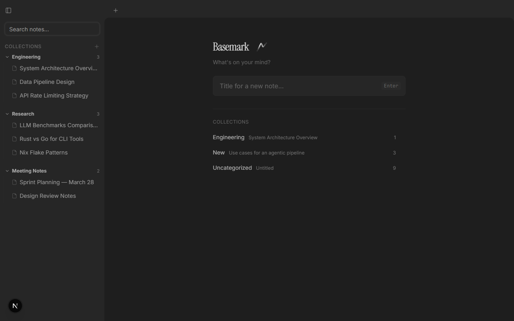

# Basemark

A minimal, keyboard-first wiki for engineers. Obsidian aesthetics, Outline-like block editing, agent-ready API.



## Features

**Editor**
- Tiptap block editor with rich text, code blocks (syntax highlighted), tables, callouts, task lists
- Mermaid diagram rendering with live preview
- Markdown paste — copy from VS Code or any source, pastes as formatted rich text
- Slash commands (`/code`, `/table`, `/callout`, `/mermaid`, `/image`, `/youtube`)
- `[[` doc linking with autocomplete
- Bubble menu on text selection (bold, italic, highlight, link)

**Navigation**
- Sidebar with Files and Search views, fully collapsible
- Tab system with keyboard shortcuts
- Command palette (`Ctrl+K`) with fuzzy document search
- Full-text search via SQLite FTS5

**Mobile**
- Full-screen notes list with bottom tab bar
- Swipe-to-delete, floating format toolbar above keyboard
- Bottom sheet dialogs, responsive typography

**Sharing & Permissions**
- Public toggle per document
- Email invite for view access (Google SSO)
- Token-based share links

**Agentic**
- REST API with bearer token auth
- Hosted MCP server at `/api/mcp` with 9 tools
- [Rust CLI](https://github.com/fmayala/basemark-cli) companion with local MCP server
- API token management in Settings

## Stack

| Layer | Technology |
|-------|-----------|
| Framework | Next.js 16 (App Router) |
| Editor | Tiptap v3 (ProseMirror) |
| Database | SQLite (local) / Turso (production) |
| ORM | Drizzle |
| Search | SQLite FTS5 |
| Styling | Tailwind CSS v4 + shadcn/ui |
| Auth | NextAuth (Google SSO) |
| Animations | Framer Motion |
| Fonts | Inter, Instrument Serif, JetBrains Mono |

## Setup

```bash
# Install dependencies
bun install

# Set up environment
cp .env.local.example .env.local
# Edit .env.local with your Google OAuth credentials

# Run migrations
bun run db:migrate

# Start dev server
bun run dev
```

Open [http://localhost:3000](http://localhost:3000).

## Environment Variables

```bash
# Auth
NEXTAUTH_URL=http://localhost:3000
NEXTAUTH_SECRET=           # openssl rand -base64 32
GOOGLE_CLIENT_ID=          # from Google Cloud Console
GOOGLE_CLIENT_SECRET=      # from Google Cloud Console
ALLOWED_EMAIL=             # your Google email

# Database (production)
TURSO_DATABASE_URL=        # libsql://...
TURSO_AUTH_TOKEN=           # from Turso dashboard
```

## Deploy

Deploys to Vercel with Turso for production database.

```bash
vercel deploy
```

Set environment variables in Vercel project settings.

## CLI

The [Rust CLI](https://github.com/fmayala/basemark-cli) provides programmatic access:

```bash
cargo install basemark-cli

basemark config set url https://basemark.wiki
basemark config set token bm_...

basemark list
echo "# My Note" | basemark create --title "My Note"
basemark read <id>
basemark search "query"
basemark mcp  # start local MCP server
```

## Keyboard Shortcuts

| Shortcut | Action |
|----------|--------|
| `Ctrl+K` | Command palette |
| `Ctrl+N` | New document |
| `Ctrl+\` | Toggle sidebar |
| `Ctrl+Shift+F` | Global search |
| `Alt+W` | Close tab |
| `Alt+[` / `Alt+]` | Previous / next tab |
| `Ctrl+1`-`9` | Jump to tab |
| `/` | Slash commands (in editor) |
| `[[` | Link to document (in editor) |

## License

MIT
